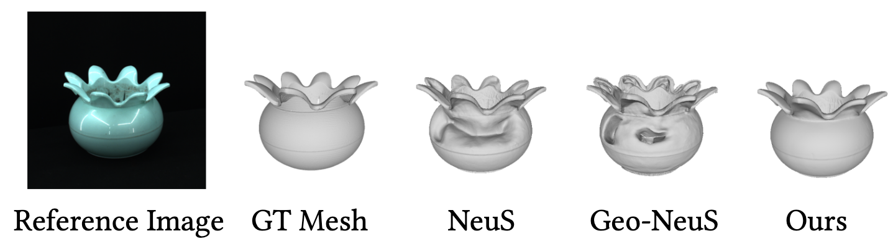

# Factored-NeuS: Reconstructing Surfaces, Illumination, and Materials of Possibly Glossy Objects

  
  

## Abstract
We develop a method that recovers the surface, materials, and illumination of a scene from its posed multi-view images. In contrast to prior work, it does not require any additional data and can handle glossy objects or bright lighting. It is a progressive inverse rendering approach, which consists of three stages. First, we reconstruct the scene radiance and signed distance function (SDF) with our novel regularization strategy for specular reflections. Our approach considers both the diffuse and specular colors, which allows for handling complex view-dependent lighting effects for surface reconstruction. Second, we distill light visibility and indirect illumination from the learned SDF and radiance field using learnable mapping functions. Third, we design a method for estimating the ratio of incoming direct light represented via Spherical Gaussians reflected in a specular manner and then reconstruct the materials and direct illumination of the scene. Experimental results demonstrate that the proposed method outperforms the current state-of-the-art in recovering surfaces, materials, and lighting without relying on any additional data.

Overview:

  

## Reconstruct surface and materials for DTU (left) and SK3D (right).

  

  

## Reconstruct surface and materials for the Shiny dataset.

  

  

## Reconstruct materials and illumination.

  

<video id="video" controls="" preload="none" poster="rendering">
      <source id="mp4" src="video/hotdog/rendering.mp4" type="video/mp4">
</video>

  

## Diffuse and specular decomposition results in the first stage

  

## Results from the first stage

  

  

  

## Additional mesh comparison results.

  

  

  

## Relighting comparisons.

  

